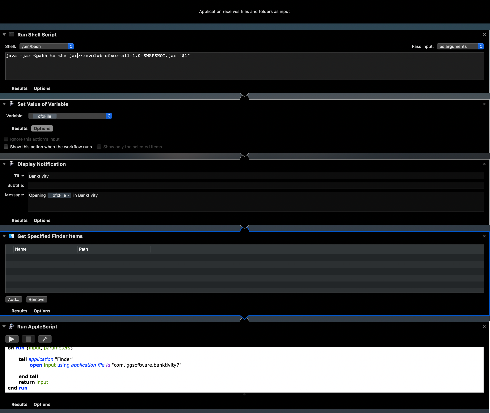

# Revolut OFXer

A small project allowing to transform CSV Revolut statements downloaded from the mobile app to be transformed into OFX files before importation into a compatible Financial software.

## Usage

An auto-executable jar file gets created with the gradle task "fatJar".
This auto-executable takes the path to a Revolut CSV file as an input.

The process follows the steps:
1. Recognize the account currency thanks to the header of the CSV file
1. Parse the CSV into single RevolutCSVLines objects
1. Iterate through all the lines to produce a relevant model Statement composed of a list of Transaction
1. Write the statement information into an OFX format
1. Write the result into a file **currency**.ofx in the same folder than the original csv file (it will replace the file if already existing)

Note that at the very end of the process, the program prints in the console the full path of the ofx file. This is used to automate operations in MacOS Automator on my end by parsing that info and sending it back to the next software.

## Automation

Automation can rely on this small Java program to improve the ofx integration.
You can define batch files or programs that will:
1. be triggered when dropping the CSV file onto their icon
1. will execute automatically the java call
1. will send the result to a compatible program

In my case I am using a mix of [Automator](https://support.apple.com/en-gb/guide/automator/welcome/mac) on MacOs and AppleScripting to ensure the importation is made automatically to [Banktivity](https://www.iggsoftware.com/banktivity/)

### Automator

The Automator Application on macOS will use the following steps:
1. Run Shell Script
    * Set it to Pass Input as Arguments
    * the shell script will call
    `java -jar <path to the fat jar>/revolut-ofxer-all-1.0-SNAPSHOT.jar "$1"`
1. Set Value as Variable (to store the console output into a variable, that output being the ofx file location)
    * Variable: ofxFile
1. Displays a notification containing the path to the file we import (makes it nicer)
1. Get Specified Finder Item (which is required to set up the file path as an input to the next action)
1. Run Apple Script which will automatically import the ofx into Banktivity
    ```
    on run {input, parameters}
    	
    	tell application "Finder"
    		open input using application file id "com.iggsoftware.banktivity7"
    		
    	end tell
    	return input
    end run    
    ```
    


